# What's this?

Beamr is a markup language (and interpreter thereof) for creating PDF slide shows from simple, easy to understand text files.

This is the documentation for version 0.3.5. [Other versions](/beamr/doc/)

Please note that this software is currently under development and the PyPI version might be momentarily behind the version on Github or that of this documentation.

# Installation

Simplest way, install from PyPI using Pip:

    pip install beamr

To avoid some potential inconveniences which are explained below, it is recommended to install Beamr inside a virtual environment or Anaconda distribution if you are familiar with those. By placing a link to the `beamr` script somewhere globally accessible, you can then invoke it from outside the virtual environment as well.

Then check that it installed properly:

    beamr -h

This should print the help message. The `beamr` executable might not be immediately recognised due to [a common Pip issue](https://github.com/pypa/pip/issues/3813), in which case you will need to add it to your shell's path:

    export PATH="$HOME/.local/bin:$PATH"

To avoid typing the above command every time you start a new shell instance, add it to the end of your shell configuration. On most systems using `bash`, this is accomplished by:

    echo 'export PATH="$HOME/.local/bin:$PATH"' >> ~/.bashrc

You can always run the package explicitly as well. Check that the help message is being displayed:

    python -m beamr -h

If installing system-wide (with `sudo`) you may see some warnings about file access permissions (`Errno 13`) when running `beamr` subsequently. They are inoffensive, but you can get rid of them by running the program with `sudo` once, allowing a certain module to fix itself persistently.

Alternatively, [download a copy from Github](https://github.com/teonistor/beamr/zipball/master) and run the package locally: `python -m beamr` (with the various caveats of doing so, circumventable by setting shell aliases, paths etc)

## Dependencies

The interpreter runs on Python 2.7 and 3.4 onwards. Bugs are more likely on 2.7 as backwards compatibility has been added later.

The following Python packages are mandatory and will be added automatically when installing using Pip:
- `ply` 3.11 or newer
- `pyaml` 17.12 or newer
- `docopt` 0.6 or newer

The intended use of the program requires `pdflatex` to be called internally; for this a number of `texlive` packages are required and can be installed from the system package manager, e.g.:

    apt install texlive-latex-base texlive-generic-recommended texlive-fonts-recommended texlive-font-utils texlive-extra-utils cm-super

These packages were used throughout development and testing. However if the intention is simply to generate LaTeX sources for use in an external engine (e.g. Sharelatex) this can be done without having `texlive` installed at all.

Optional dependencies (recommended but not mandatory):
- `PIL` package for certain more advanced image arrangement features – installable from Pip:

      pip install Pillow

- `pygmentize` executable for code listings using the *minted* environment – installable from your system package manager e.g.:

      apt install python-pygments

- `latexmk` for automating multiple calls to pdflatex – installable from your system package manager e.g.:

      apt install latexmk

# Concept

The fundamental building block of a Beamr source is the slide. A slide show is a succession of slides, in the order given in the input file; however, more pages can be generated in the resulting PDF document than there are slides in the input file (for instance because of an automatically generated table of contents, or due to transitions inside slides).

Within the slides, text can be written plainly or by employing any of the numerous constructs which are discussed in detail in the next section.

The generation of LaTeX code (and thus of the resulting PDF document) is driven by a user-editable configuration taking the form of a large dictionary, which can be altered by inserting Yaml blocks in the source file (outside slides), in a configuration file in the user's home directory, or directly via command line arguments. The order of precedence of these blocks as well as the meanings of different dictionary keys are explained further down.

## Program Execution

The first usage line from the help message is the most important. Everything is optional, but most commonly an input file will be given. A `.bm` file extension is implied if a file doesn't exist exactly as given. The same name, with a `.pdf` extension, will be used if an output file name is not specified.

For example, if the source file is `demo.bm`, run:

    beamr demo

A file `demo.pdf` will be created, alongside `demo.tex` containing the generated LaTeX source, and the usual bunch of other files `pdflatex` generates.

To create only the LaTeX source:

    beamr -n demo

To create the LaTeX source in a differently named file (note the `-n` option isn't necessary when the output file name ends in `.tex`):

    beamr demo othername.tex

Usually pdflatex generates a ton of output, therefore to hide it run:

    beamr -q demo

To read a file whose name begins with a dash (e.g. `-foo-bar`):

    beamr -- -foo-bar

To read from standard input but generate a PDF file:

    beamr - demo.pdf

To read Beamr source from stdin and write LaTeX code to stdout and create no files (in the style of Unix pipes):

    beamr - -

By default Beamr will try to use Latexmk to save the trouble of multiple runs, bibliography files etc, falling back to pdflatex (it will first secretly call `latexmk --version` to check the existence of Latexmk on the system). To avoid Latexmk altogether for whatever reason:

    beamr --nomk demo

To use another program instead of Latexmk:

    beamr -g /path/to/program

To use another program instead of pdflatex:

    beamr --nomk -g /path/to/program

# Language Specification

## Constructs Summary

The following constructs will be referred to throughout this documentation. Below is a handy table outlining which constructs can be used where by their line span, which will be useful to remember:

&nbsp; | Out of slide | In slide | Either
---:| ------------- | ------------- | -----
\>0 | Ignored text | Image frame, list, text | Macro
1   | Scissors | Square bracket constructs, emphasis, footnotes, escaping, inline LaTeX, arrows | Comment
\>1 | Slides | Column, box, Org table, verbatim, Plus | Raw LaTeX
2   | Heading |      |
\>2 | Yaml configuration | |

## Slide
    [<decorOption><alignOption><contentOption> <title>
    <background>
      <content>
    ]

Opening and closing square brackets must be placed at the very beginning of lines of text (with no white space). Everything inside is optional:

`<decorOption>`: A leading slash (`/`) will remove all Beamer decorations (headers, footers, navigation buttons)

`<alignOption>`: Set vertical slide contents alignment. By default centred, `_` aligns to the bottom, `^` aligns to the top.

`<contentOption>`: Specify what should happen if the contents of the slide do not fit on a page. They can be split across multiple pages (`...`) or shrunk to fit (`.`). You can also enforce shrinking by a percentage of your choice (e.g. `.14`). Note that shrinking forces top alignment.

`<title>`: The title of the slide

`<background>`: To provide a background image for the slide, begin the line after the title with a tilde (`~`) then give the file name, which must be relative to current location or on the graphics path. By default the image will fit the width of the slide; to fit it to height place a vertical bar (`|`) at the end of the line

`<content>`: The content of the slide. Indentation is optional but may help you better visualise the structure of your document.

Example:

    [ First slide
      In this presentation we will be talking about slides.
    ]
    [ Second slide
      This is the second slide.

      It contains two paragraphs.
    ]
    [.20 Third slide
      The text on this slide will be 20% smaller than usual.
    ]
    [
      This slide has no title.
    ]
    # Nothing but an image
    [/
    ~res/house
    ]

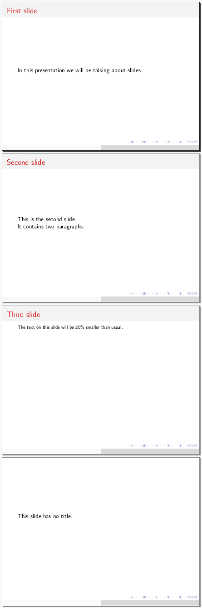

## Text

Plain text is simply written as such. Paragraphs need to be separated by an empty line, as per LaTeX convention.

## Heading
    <title>
    <symbol streak>

Headings are given outside of slides by following a line of text with a streak of one of the symbols `- _ = ~` repeated at least 4 times. The symbols will be understood to define sections, subsections, and subsubsections in the order in which they are encountered in the source file.

Once headings are employed, tables of contents can be created at various points in the slide show (more details are in the Configuration section). Tables of contents usually take two runs of `pdflatex` to fully populate, and once they do, entries are clickable.

Example:

    ---
    # The generated table of contents is shown on the right
    toc: yes
    ...

    Introduction
    ----
    # At least one slide is needed under each heading for it to take effect
    [
    ]

    Food
    ----
    [
    ]

    Salad
    ~~~~
    [
    ]

    Pasta
    ~~~~
    [
    ]

    Drinks
    ----
    [
    ]

    Beer
    ~~~~
    [
    ]

    Cider
    ~~~~
    [
    ]

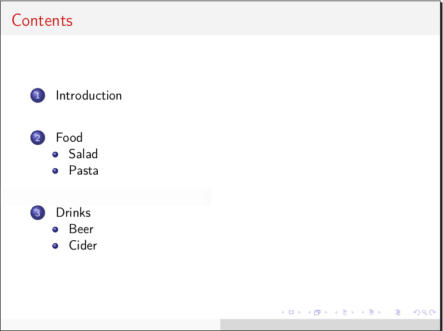

## List
Unnumbered list: `<marker><pause> <content>`

Restarting numbered list: `<marker>.<pause> <content>`

Resuming numbered list: `<marker>,<pause> <content>`

Description list: `<marker>=<pause> <describee>=<description>` or `<marker>=<pause> <content>`

`<marker>`: A dash (`-`) for a normal item, or an asterisk (`*`) for a highlighted one

`<pause>`: Optionally add a plus symbol (`+`) for items you wish to be revealed in turn on the next page of the slide

`<content>`: The content of the list item. This can be multiline and contain any other in-slide constructs but needs to be indented relative to the marker.

`<describee>`, `<description>`: In a description list, a multi-word describee needs to be separated from the description by an equal sign. If this is missing, the first word of the content will be considered to be the describee

Example:

    [
    Ordinary bullet list:

    - bullet
    - bullet
    - more bullet
    ]

    [
    Numbered list on a few levels, each item telling you what it will be numbered:

    -. one
    -, two
      -, one
      -. two
        -. one
    -. three
      -, three
      -, four
    -. four
    -, five
      -. one
    -. six
      -. one
    ]

    [
    Description list:

    -= Apple=a fruit
    -= Fruit with long name=another fruit
    -= Potato vegetable
    ]

    [
    List where items will be revealed one by one and highlighted when they appear:

    *+ one
    *+ more
    *+ time
    ]

    [... Complicated nested list

    -. one
    -, two
      -. one
      -, two
          -. one
    -. three
      -, three
      -, four
    -. four
    -, five
      -, five
    -. six
      -. one
    - Bullet
    -. one
      -, two
    -= Describee description description
    -, two
      -, three
      -. four
          -, two
          -. three
    -. three
    - Bullet
    -. one
      -. one
      - Bullet
      -. one
          -. one
              -, two
          -= Description list=this thing
        -. two
      -, two
      -. three
          -. one
          - bullet
          -. one
          - bullet
          -, two
    ]

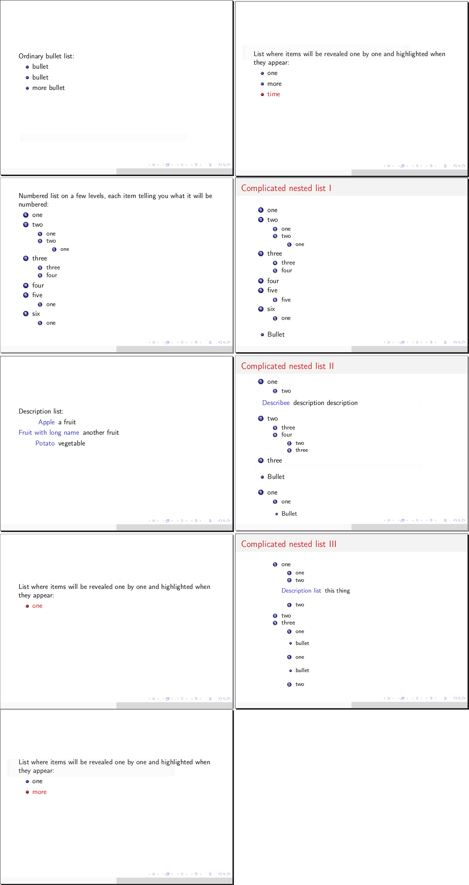

## Column
    |<width><align>
      <content>

`<width>` (optional): Relative to slide width (e.g. `35%`), or relative to other columns (e.g. `7`). In the latter case, columns will split between themselves, proportionally with their numbers, the space unclaimed by columns in the former case. Not specifying a width is equivalent to giving a relative width of 1.

`<align>` (optional): Set vertical alignment of column contents. By default centred, `_` aligns to the bottom, `^` aligns to the top. This setting should only be used in the first column of a set as it affects the entire set. If content in one column is repeated across multiple slides (with different content in another column) and the default center alignment causes an undesired transition jitter, consider top-aligning all the slides and columns in question.

`<content>`: Can contain any in-slide construct. Must be indented relative to the vertical bar

Multiple column environments can exist on the same slide, as well as columns inside columns, although that is a rather strange use case.

Example:

    [
    Text before the columns

    |30%
      This is a narrow column on the left

    |
      This is a wide column on the right

    Text after the columns
    ]

    [
    |1
      First column

    |4
      Second column, which is 4 times as wide as the first
    ]

## Emphasis
`<flag><text><flag>`

`<flag>`: `_` for italics, `*` for bold, `__` for underline, `**` for alert (coloured in red by default). The closing flag must match the opening one.

`<text>`: The text to be emphasised. It must not start or end with white space. It cannot be broken across multiple lines, but it can contain other constructs that fit on one line.

Example:

    [
    _Italicised text_

    *Bold text*

    __Underlined text__

    **Alerted text**

    __*Bold and underlined*__

    *Bold and _italics_*
    ]

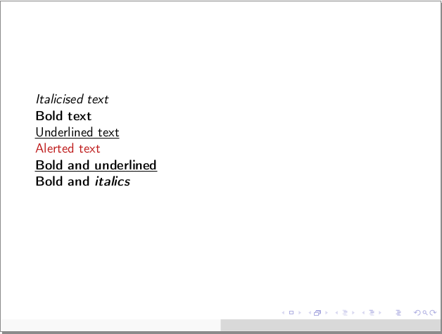

## URL
Same text and target: `[<target>]`

Different text and target: `[[<text>]<target>]`

`<target>`: Path to website or file that the URL will open when clicked

`<text>`: Text to be shown

Example:

    [ URLs
    For more information visit [[my website]https://teonistor.github.io/beamr/]

    For help, search [https://tex.stackexchange.com/]
    ]

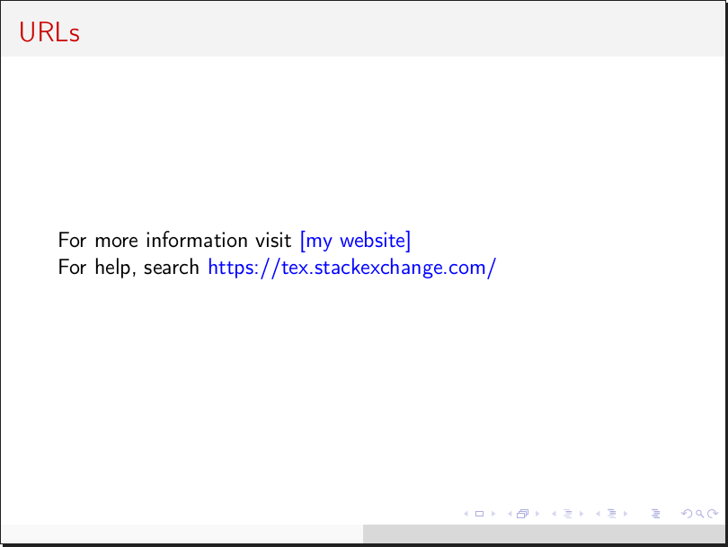

## Square Bracket Construct
Long form: `[<flag><text><flag>]`

Short form: `[<flag>]`

`<flag>`: A combination of up to 3 of the following characters: `<>_^:+*~.=!|@`. The closing flag must match the opening one, except if it is a single angle bracket.

`<text>`: The text to be processed. It cannot be broken across multiple lines, but it can contain other constructs that fit on one line.

This construct is intended for customisation. You can define your own long-form and short-form commands in the configuration, as will be detailed in the next section. There are many combinations to choose from the characters above and a few have been defined by default:
- `<>`: Text stretched across whole slide width
- `><`: Centred block of text
- `<<`: Left-aligned block of text (redundant by default, but relevant if justification to both sides set)
- `>>`: Right-aligned block of text
- `==`: Fixed width text
- `~~`: Struck out text
- `+` : Insert a pause (text after this will appear on the next page of the slide)
- `>` : Insert a horizontal filler
- `^^`: Push this text up by amount specified, e.g. 3em (use negative numbers to push down)
- `..`: Footnote sized text
- `:`: Insert a fixed vertical space of 5mm

The interpreter looks up what to do in the following order: first it checks for both the start and the end flags, concatenated; then for the start flag alone; then for the start flag in the emphasis dictionary. This last point means that you can also create bold, underlined text etc through the square bracket construct, which is helpful if you use symbols in text in a way that could be misinterpreted as flags.

Keep in mind the order above when defining your own commands. For instance, if you want to use the construct like this: `[^_ fancy text ^_]` it is OK to add your command to the key `^_` since this key is not already in use. On the other hand, if you wish to do something like `[>< fancier text ><]` you need the key in the dictionary to be `><><`, as merely using `><` would obliterate the centred text command already defined (this would not break the program, but could lead to unexpected results).

Example:

    [
    [>Right-aligned text>]

    [>Centred text<]

    [.Footnote sized text.]

    [>]Let's[>]use[>]horizontal[>]fillers[>]~

    [^-3cm^]Push this text down by 3~cm

    [=2+2 = Fixed width=]
    ]

    [
    [<Boom!>]
    ]

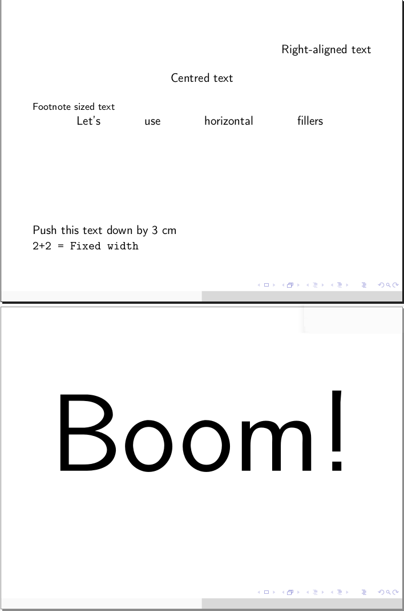

## Footnotes and citations
Footnote with label: `[-<label>:<text>-]`

Footnote without label: `[-<text>-]` or `[-:<text>-]` (if the text contains a colon)

Re-reference a previous footnote: `[-<label>:-]`

Citation with options: `[--<citation>:<options>]`

Citation without options: `[--<citation>]`

`<label>`: An optional label that can be attached to a footnote to allow it to be referenced more than once

`<text>`: Footnote text. It cannot be broken across multiple lines, but it can contain other constructs that fit on one line.

`<citation>`: Name of an entry in the bibliography file (defined in the configuration as detailed in the next section)

`<options>`: Additional options to be passed to LaTeX's `\cite` command

Example:

    [
    This presentation is very interesting[-As I mentioned in my _previous_ presentation-].

    This footnote[-24:This one-] has a label, which I can now use to refer to it again[-24:-]. You can even do that across different slides.

    If you need a colon in the footnote text you can give it an empty label[-:Meet at 15:30-].

    Beamr uses PLY[--plyman] for lexing and parsing.
    ]
    ---
    # Set bibliography file
    bibFile: res/bib
    ...

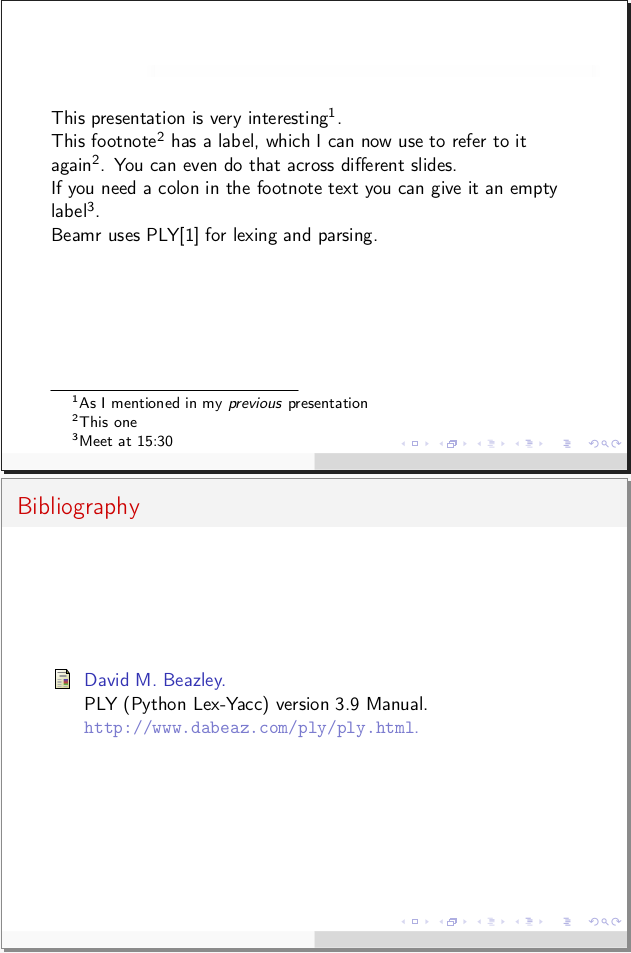

Note that for historical reasons, in order for citations to work you must create and specify a bibliography file, then compile it using `bibtex` and run LaTeX (directly or implicitly through Beamr) twice for all references to settle. Similarly, re-referenced footnotes will need two runs of `pdflatex` to be fully resolved.

## Box
    (<flag><title>
      <content>
    )

`<flag>`: An asterisk (`*`) for a normal box, a bang (`!`) for an alert box, or a question mark (`?`) for an example box

`<title>` (optional): The title of the box

`<content>`: Can contain any in-slide construct. Indentation relative to the round brackets is recommended but not mandatory.

The closing paranthesis must be on the same level of indentation as the opening one.

Example:

    [
    (* Normal box
      |65%
        We can have columns inside the box
      |
        This right-side column is narrower
    )

    (! Alert box
      What can exist inside a box:
      - Columns
      - List
      - Anything
    )

    (? Example box
      $n^2 + 2n + 1$
    )
    ]

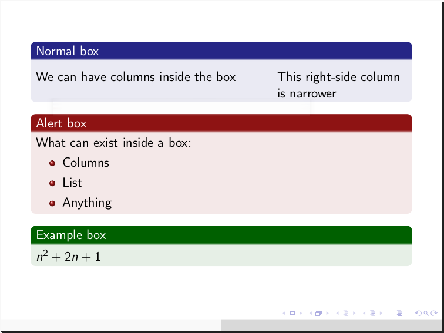

## Ascii Art
A few 3-symbol sequences will be recognised and replaced with appropriate LaTeX commands for producing arrow symbols and for other purposes:

    -->
    <->
    <--
    |->
    ==>
    <=>
    <==
    \\    # New line e.g. in a table cell
    \\\   # Literal backslash
    ...   # Horizontal ellipsis
    :::   # Vertical ellipsis
    :..   # Diagonal ellipsis

## Image Frame
`~{<filenames> <shape> <size>}`

`<filenames>`: One or more file names (paths) on one or more lines. File extensions are optional and paths can be relative to the graphics path or absolute. Separating file names on several lines is only relevant when creating a grid. A dot (`.`) can be inserted instead of a file name to produce an empty cell in the grid.

`<shape>` (optional): If you want to use several images, specify whether they need to be arranged in a horizontal strip (`-`), vertical strip (`|`), or grid (`+`).

`<size>` (optional): `width` or `<width>x<height>` or `x<height>`. Width and height can be absolute (e.g. `5cm`) or relative to the corresponding dimension of the text area (e.g. `40`, meaning 40%). If unspecified, the size defaults to the full width of the text area, except for the vertical strip, where it defaults to full height.

Remember that a line beginning with `~{` immediately after the opening of a slide is treated as a background image declaration, therefore to use the image grid an empty line is necessary.

The behaviour of the image frame is affected by the "safe" flag and by whether the PIL module is available in Python, as explained in the diagram below:

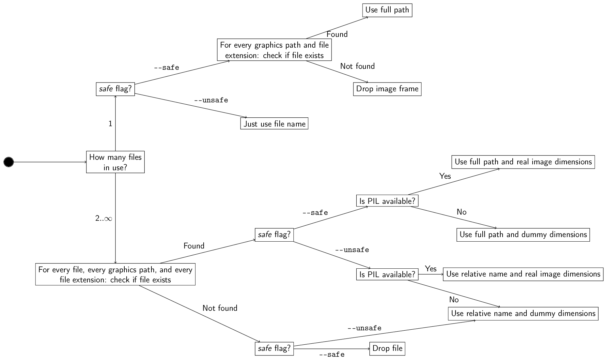

Example:

    [ One image
    Below is an image of boats in the sunset, taken somewhere around Lymington Pier:

    ~{boats}
    ]

    [ Matrix

    ~{house boats house
      seven beach
      house seven boats + }
    ]

    [ Inline and grids
    Small images can be used in line: 1 2 3 4 5 6 ~{seven x1em} 8 9

    Now let's write the number 7 out of images of itself:

    ~{seven seven seven seven
      . . seven .
      . seven . .
      seven . . . + 30}
    ]

    [ Horizontal strip

    ~{house boats seven boats -}

    Of course, you can squeeze an image by specifying both dimensions:

    ~{seven 4cmx2cm}
    ]

    [ Vertical strip

    ~{house boats house beach boats |}
    ]

    [ Two vertical strips
    |15%
    ~{ boats house seven house beach | 100}
    |
    [>This slide presents you some text enclosed between two vertical image strips.<]
    |15%
    ~{beach boats seven house beach | 100}
    ]
    ---
    # Remember to set the graphics path
    graphicspath: res
    ...

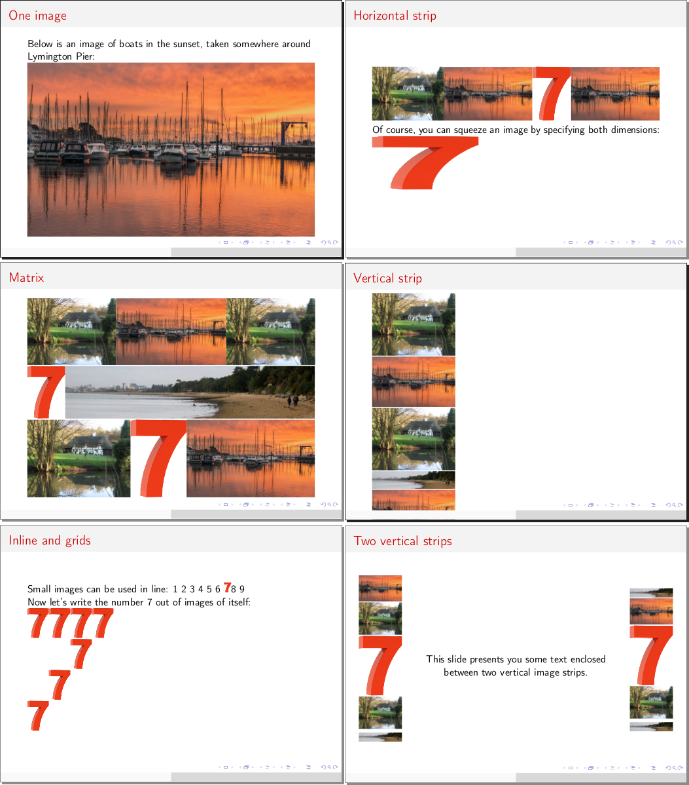

## Verbatim (code listings)
    {{ "{" }}{<language>
       <code>
    }}

`<language>` (optional): Language that the code is in, for syntax highlighting. Note that support varies depending on whether the "listings" or "minted" environment is used.

`<code>`: Code to be listed. Indentation relative to the braces is recommended but not mandatory.

The opening and closing pairs of curly braces must be on the same level of indentation.

By default, the "listings" environment is used. You may wish to switch to the better-looking "minted" environment in the configuration, but in order for it to work you must have the `pygmentize` executable available on your machine, otherwise `pdflatex` will fail.

Example:

    ---
    verbatim: minted
    ...
    [
    {{ "{" }}{c++
      #include<bar>
      int main() {
        printf("is wider\n");
      }
      /* Or is it */
    }}
    ]

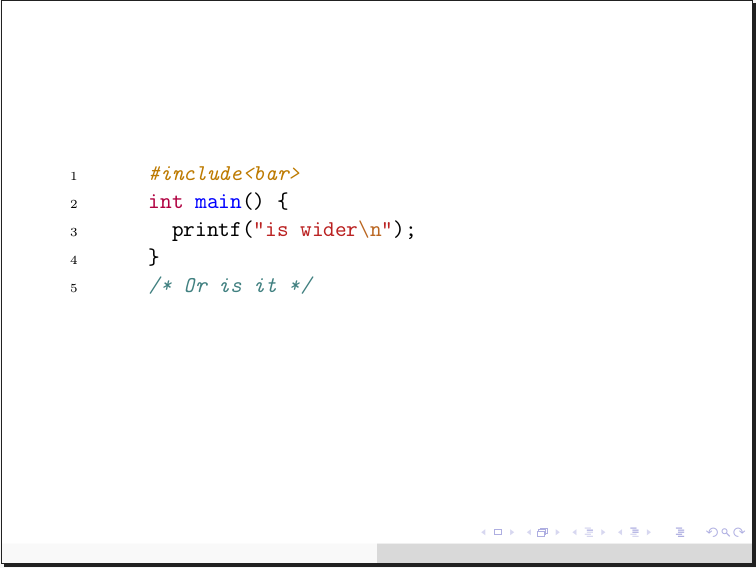

## Org Table
    | <cell> | <cell> | ... |
    |--------+--------+-...-|
    ...

`<cell>`: Contents of a cell in the table. Single-line, but can contain other constructs (although beware that some may cause problems). Vertical bars (`|`) in here need to be escaped.

Tables are supported in Org Mode format, with some additional formatting features:

- Horizontal lines can be added at any point and work irrespective of the position/existence of `+` characters within
- On the first line, a doubled vertical bar (`|`) will create a vertical line at that location through the table
- Change alignment by beginning cell contents on the first line with one of the following symbols (which will not be included in the contents):
   - `<` for left alignment
   - `>` for right alignment
   - `^` for cetering
   - `.` for decimal point alignment
   - `,` for decimal comma alignment
   - `-` for justification

Example:

    [ Tables 1
    *Small tables stay centred*

    |-------------------|
    | Dec || Bin || Hex |
    |-------------------|
    |  2  | 10    | 2   |
    |  18 | 10010 | 12  |
    |  31 | 11111 | 1F  |
    |-------------------|

    *Using justification makes them wide*

    |No|| Name |-Description|
    |---+------+------------|
    |1|Banana |Long, yellow, pitless fruit. [.(Ordinarily seen green-shaded in supermarkets, because supermarkets are greedy and want to sell you raw fruit.).]|
    |2| Apple |Round fruit comind in a variety of sizes and colours.|
    |3|Avocado|Pretentious fruit difficult to get right at the store. Nevertheless, my favourite.|
    ]

    [ Tables 2
    *Tables in columns*
    [:]

    |
      [>$ f(x) = x^2 - 5 $<]

      | $x$||<$f(x)$|
      |-------------|
      | -5 |  50    |
      |  2 | -1     |
      |  3 |  4     |
      |  4 | 11     |
      | 10 |  95    |
    |
      [>$ g(y) = y^2 + 3y + 7 $<]

      | $y$||<$g(y)$|
      |-------------|
      | -5 | 17     |
      |  2 | 17     |
      |  3 | 25     |
      |  4 | 35     |
      | 10 |  137   |
    ]

    [ Tables 3
    *Alignment works sensibly on its own*

    | Text      ||Integers||Decimal points||Decimal commas |
    |-------------------------------------------------|
    | Text will  |  31     |  3.14    |  2,718   |
    | by default |  24     |  49      |   -14    |
    |     be     | -150    |   -2.5   |  14,18   |
    |left-aligned|  3      |   22.4   |   ,281   |

    *You can have highlighting in cells*
    |--------+---------------------+-----|
    || Name  |  ^Phone             | Age ||
    |--------+---------------------+-----|
    | *Peter*| [~999~]             | 17  |
    | _Anna_ |4321[-And footnotes-]| 25  |
    | **Bob**|  1234               | 22  |

    ]
    [ Tables 4

    *Tables in lists*

    *+ I don't know why you would want to do this, but...
    -+ you can have tables inside lists if you're so inclined.

      *.+ Like this one about colours:
          |>Colour||Code |
          |--------------|
          |  Red  |\#FF0000|
          |  Cyan |\#00FEFE|

      *.+ Or this, about number bases:
          |------------------|
          | Dec|| ^Bin ||Hex |
          |------------------|
          |  2  | 10    | 2  |
          |  18 | 10010 | 12 |
          |  31 | 11111 | 1F |
          |------------------|

    [+]
    ]

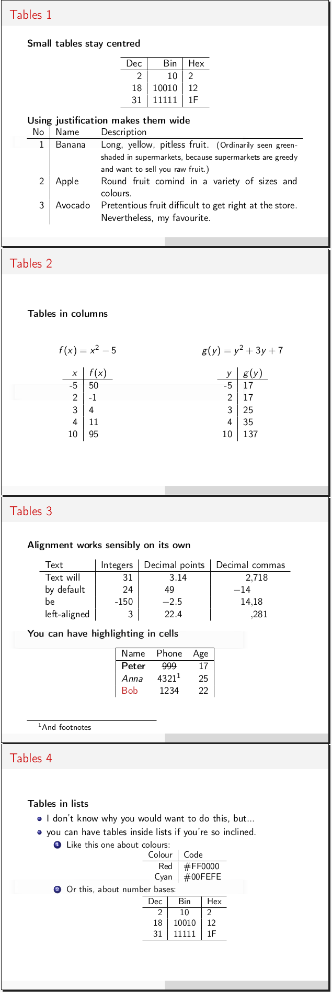

## Inline LaTeX
`\<name><arguments>`

`<name>`: Name of LaTeX command, letters only, optionally ends in an asterisk

`<arguments>`: An array of zero or more arguments enclosed in curly, square, or angle brackets. There must be no spaces between the arguments.

Nested commands using the same type of bracket will only be recognised if the respective closing brackets are immediately one after another. Even when not properly recognised, commands will go unaltered into LaTeX unless they clash with the constructs described here. Most notably, square brackets are to be paid attention to.

Example:

    [
    Let's print the nice \LaTeX\ name.

    This text is {\color{green}green}.
    ]

## Raw LaTeX
    &{
      <latex>
    }

`<latex>`: Anything that should be passed unmodified into LaTeX code

The closing curly brace must be on the same level of indentation as the ampersand. This construct can be used both inside and outside slides.

## Scissors (document concatenation)
`8<{<filename> <pages>}` or `>8{<filename> <pages>}`

`<filename>`: Path to PDF file from which to include pages

`<pages>` (optional): Page ranges to include (e.g. `1,2,4-7`), must not contain spaces

This construct can only be used outside of slides.

The behaviour of the scissors construct is affected by the "safe" flag. If the flag is set (default) Beamr will check the existence of the file and omit it if not found; if the "safe" flag is not set, a warning will be raised but the file will still be included.

Example:

    8<{otherdoc.pdf 2-5,7,10}

## Yaml Configuration Block
    ---
    <yaml>
    ...

Configuration blocks are used to change parameters used in the generation of PDF documents, or, by more advenced users, to alter templates. All blocks are collected into a large dictionary, blocks towards the top of the file overriding those towards the bottom. The list of dictionary keys and meanings thereof are discussed in the next section.

Example:

    ---
    # Set author and title for the document
    author: John Doe
    title: A Presentation on Presentations

    # Create a square bracket construct to colour the text green
    # (note Yaml dictionary inside dictionary syntax, as well as the single quotes around strings with special characters)
    stretch:
        '_^': '\color{green}{{ "{%s" }}}'

    # Tell LaTeX to import 2 additional packages, where the second package requires options
    # (note Yaml list syntax)
    packages:
        - mypackage
        - option,otheroption,myotherpackage
    ...

## Macro
`%{<name> <arguments>}`

Macros constitute the most powerful element of the language, allowing you to define arbitrary constructs that exploit Python's ability to execute strings as code. You can use macros as shortcuts to advanced LaTeX commands, or to perform complex actions. They can be used both inside and outside slides.

To create a macro, add an entry to the `macro` dictionary in the configuration. The key is the name you picked for the macro, and as a value provide a Python code snippet that will be executed. This snippet will have access to the following local variables:
  - `arg`: an array of the arguments given in the macro (excluding its name). `arg[0]` will be the whole argument string, `arg[1]` onwards will be substrings split on white spaces
  - `beamr`: function to call if the result of the macro is Beamr code. Takes a single argument
  - `latex`: function to call if the result of the macro is LaTeX code. Takes a single argument
  - `debug`: function for printing debugging information from within the macro. Takes however many arguments, which will be printed only if the program is run with the `--verbose` option (or `-v`). Please use this instead of `print()`, which can interfere with and break the output of the program.

Any exceptions raised during the execution of the macro will be caught and reported as non-fatal errors. The full traceback of such exceptions will be printed if the verbose option is used. If a macro generates another macro statement, the behaviour is undefined; don't do that.

For a first example, suppose that you often need to draw arrows of various lengths using the `tikz` package; but inlining the appropriate command each time is cumbersome and ugly.

As another example, suppose you are head of cyber security at a company and frequently need to include in presentations the beginnings of the first few `<script>` tags of various web pages. This can be automated right inside a macro with the appropriate Python packages installed.

    ---
    # Essential set up
    title: Macros Examples
    footer: counter title
    sectionToc: yes
    verbatim: minted

    # First we must tell pdflatex to include the tikz package for first example
    packages: tikz

    # Now we define our macros. Note Yaml multiline string syntax
    macro:
      arrow: |
        code = r'\tikz[baseline=-0.5ex]{ \draw [%s-%s] (0,0) --   (%s,0); }'
        if arg[1] == '>':
            latex(code % ('|', '>', arg[2]))
        elif arg[1] == '<':
            latex(code % ('<', '|', arg[2]))

      script: |
        import requests, re
        a = requests.get(arg[1]).text
        a = re.findall(r'<script[\s\S]*?<\/script>', a)
        a = map(lambda s: '  '+s[:int(arg[3])], a[:int(arg[2])])
        a = '\n{{ javascript\n' + '\n'.join(a) + '\n}}'
        beamr(a)
    ...

    Arrow macro
    -----------
    [ Little arrows
    %{arrow > 1em} %{arrow > 2em} %{arrow < 3em}

    %{arrow < 4em} %{arrow < 1em} %{arrow < 1em} %{arrow > 3em} %{arrow > 4em}

    %{arrow < 3em} %{arrow > 1em} %{arrow < 1em} %{arrow < 3em}
    ]
    [ Big arrows
    %{arrow > 16em} %{arrow > 26em} %{arrow < 23em}

    %{arrow < 23em} %{arrow > 14em} %{arrow < 18em} %{arrow < 25em}
    ]

    Script tag macro
    ----------------
    [.20 Google scripts
    First 5 scripts from [https://google.com]
    %{script https://google.com 5 200}
    ]
    [ BBC scripts
    First 3 scripts from [https://bbc.co.uk]
    %{script https://bbc.co.uk 3 150}
    ]

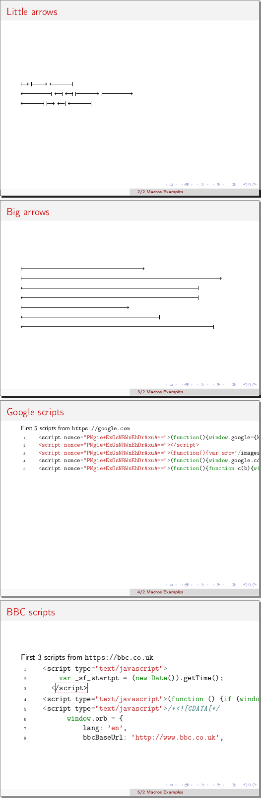

## Escaping
Special characters will generally go through unaltered, unless they form part of constructs described here. Otherwise, they can be escaped by adding a backslash (`\`) in front.

Some characters (`%` and `&` by default) have special meaning in LaTeX but not in Beamer when occurring on their own, therefore will be escaped when going into LaTeX. This concept is called "antiescaping" and the set of characters conforming to it can be configured. For instance, you may wish to antiescape `$` in a presentation about stock markets, but not in one about equations (if you use inline mathematics).

## Comments

Comments can be given by using the hash symbol `#`. Should this symbol be actually required in the document, it can be escaped: `\#`. Note that comments do not work inside certain structures. Also note that `#` is problematic in LaTeX and therefore will in turn be escaped for you in the LaTeX source (this will not happen inside raw LaTeX blocks or inline commands, which are the only places where you could ever need a lone `#` in LaTeX).

## Plus Integration

    [
      <plus>
    ]

`<plus>`: Plus code, e.g.:

    [
      {node} --> {node}
      {node}* .  {node}
    ]
    *: red

Note that this construct incurs 3 nested pairs of square brackets which must exist on their own, matching levels of indentation (slide opening/closing, Plus code, matrix opening/closing).

Plus is a markup language for graphics, under development as part of another project, thus this construct is experimental. In order for it to work, the `plus` executable must be callable from Beamr, e.g. a link to it put in the same virtual environment.

Example:

    [ Plus diagrams
      [[
        {+} --> {-} -- {+}
        {A} <-- {a}
       ]
      ]
    \hspace{2cm}
      [[
        a{1} -->* {2}(-b) -- {3}*2
        b{A} <- . {B}*
       ]
       a(->b)
       *: red
       *2: blue
      ]
    ]

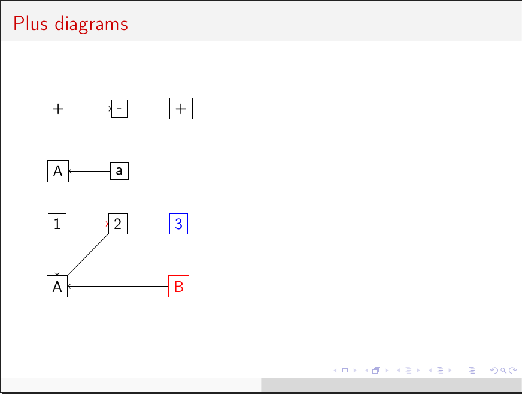

The Image frame decision diagram shown previously has also been made with Plus.

## Beamer overlay indicators

Beamer normally allows suffixing some LaTeX commands or environments with an overlay indicator in order to show some content or apply some formatting selectively on a subset of the slide's pages. For example:

- `<1>` restricts to the first page only
- `<3-5>` restricts to pages 3 through 5
- `<2->` restricts to pages 2 onwards

Beamr currently allows these to be added to the following constructs:
- Column markers (space optional)
- Simple list items i.e. not using `*` or `+` (space necessary)
- Boxes, after the closing parenthesis (with no space)
- Simple and labeled footnotes, at the end (with no space)
- Image frames and images inside the frame (with no space). The indicator of the frame will apply to all images without an indicator of their own. Note that these may behave strangely on image frames with only height specified.

Example:

    [ Lists, columns, footnotes
    |
    The following list will be revealed in a strange order:
    -. <4-> This one fourth
    -. <2-> Then this
    -. <1-> First this
    -. <5-> This one last
    -. <3-> This third

    | <3->
      This column will become visible[-But the footnote will only appear after the list-]<6-> at the same time as the bottom element in the list on the left
    ]

    [^ Boxes, images

    (? Permanent box with slowly revealing image grid
    ~{house<1-4> boats<6-> house<2-5>
      seven<4> beach<3-> beach<9->
      house<7-> seven<5-> boats<8-> + 40%}

    )

    (* Box appearing later
    ~{ house
	boats<10->
	seven - }<7->
    )<6->

    ]

    ---
    # Remember to set the graphics path
    graphicspath: res
    ...

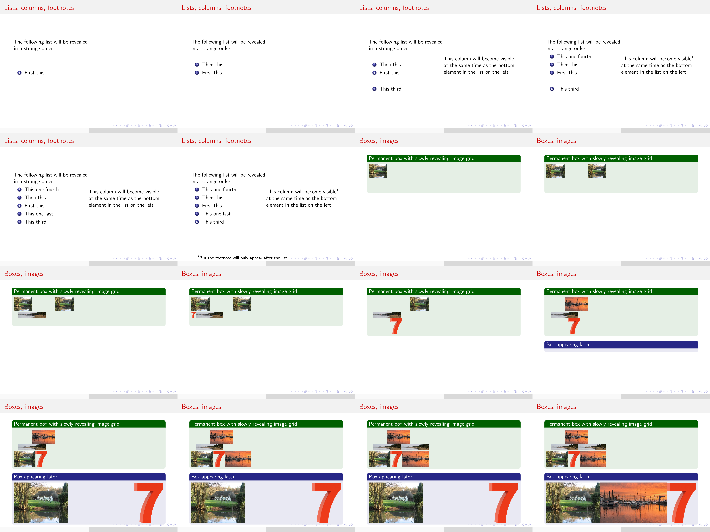

# Configuration

The program employs cascade-style configuration where many parameters and LaTeX commands are defined and can therefore be altered if the user so desires. Configuration can be given in a number of places which take the following order of precedence:
1. Command-line special flags (`-u`, `-s`)
1. Command-line configuration override (e.g. `--config='scheme: albatross'`), latest has highest precedence
1. Input file Yaml blocks, top-down
1. Yaml blocks in configuration files given on the command line (e.g. `-c mytheme.rc`), top-down. If multiple files are given, latest has highest precedence
1. User configuration file (`~/.beamrrc`) Yaml blocks, top-down
1. Implicit configuration dictionary (as defined in `beamr.interpreters.config`)

To edit the user configuration file use the `-e` (or `--edit`) flag and supply your preferred text editor, e.g.: `beamr -e kate` . On subsequent runs the editor can be omitted as it will be saved in the configuration (unless you purposefully remove it).

You can also dump the entire default configuration at the end of this file to more easily understand how and what can be edited: `beamr -ed` . It is advised to only keep what you intend to edit, so as not to unnecessarily overload the configuration resolver, as well as to avoid potential conflicts with future versions if the more advanced configuration structure changes.

Alternatively, you can save the configuration file in a location of your choice and load it using the `-c` argument.

## Configuration Keys

Unless otherwise specified, values are by default false/unset.

`safe`: Flag affecting the behaviour of constructs that include external files into LaTeX code. True by default. Can be toggled by dedicated command line arguments.

`titlePage`: Whether a title page should be generated. True by default, which means the page will be generated if at least one of `title`, `author`, `institute`, or `date` is set. Can be set to "false" to turn off the title page, or "force" to generate the page nevertheless (this is useful if the title page template has been customised in the advanced configuration to something independent of the 4 settings above).

`title`, `footer`, `author`, `institute`, `date`: Set these properties of the document, which will also be used on the title page. `date` can take a special keyword "today" which will set it to the current date. `footer` can take one or both of two special keywords "title" and "counter", which will make the footer copy the title, and include a page counter respectively (i.e. set it to "counter title" to have a footer looking like "2/8 Circuit board essentials").

`toc`: Whether to create a table of contents page after the title page

`sectionToc`: Whether to create a table of contents page at the beginning of each section, with the current section highlighted

`headerToc`: Whether to include a minimalistic contents list in the header of each slide (for themes which define one)

`tocTitle`: Title of table of contents pages. "Contents" by default.

`theme`: Theme to use for the presentation. "Copenhagen" by default. See the [gallery](http://deic.uab.es/~iblanes/beamer_gallery/index_by_theme.html) for other options.

`scheme`: Colour scheme to use for the presentation. "beaver" by default. See the [gallery](http://deic.uab.es/~iblanes/beamer_gallery/index_by_color.html) for other options.

`bibFile`: Bibliography file

`bib`: Bibliography contents. If it appears in multiple Yaml blocks, contents will be concatenated. If given, will replace contents of file specified above (or create it). If file above not specified, the name of the input file will be used (with a ".bib" extension), or "local.bib" if reading from stdin.

`bibStyle`: Bibliography style. By default "plain"

`bibTitle`: Title of bibliography page. "Bibliography" by default.

`docclass`: Document class. "xcolor={table,rgb,usenames,svgnames},beamer" by default ("beamer" class with support for tables and colour names).

`packages`: List of LaTeX packages to include. Contains the essential ones by default, more can be added to suit your needs.

`graphicspath`: List of paths to look for images in. Contains only the empty path by default.

`imgexts`: List of file extensions for images. Contains LaTeX's default list.

`antiescape`: String (not list!) of characters to be antiescaped (as described above). "&%" by default.

`emph`: Dictionary of emphasis constructs. Contains commands for single and double asterisk and underscore by default.

`stretch`: Dictionary of square bracket constructs. By default contains the commands listed in the relevant subsection above.

`verbatim`: Name of environment to be used for code listings. By default "listings", can be set to "minted"

`macro`: Dictionary of user-defined macros

`pdfEngines`: Arguments for running each underlying PDF engine, including executable name. Alter this to provide different paths or special arguments; beware of list editing rules (explained below) when dealing with arguments beginning with a dash

`docclassPre`, `packageDefPre`, `outerPreamblePre`, `outerPreamblePost`, `innerPreamblePre`, `innerPreamblePost`, `outroPre`, `outroPost`: Code insertion points where you can insert arbitrary LaTeX code into the resulting file for advanced use cases. If any appears in multiple Yaml blocks, contents will be concatenated. Refer to the list below to understand how these are spread through the document:
- [docclassPre]
- \documentclass statement
- [packageDefPre]
- \usepackage statements
- [outerPreamblePre]
- Statements defining title, author, date, theme etc
- [outerPreamblePost]
- \begin{document} statement
- [innerPreamblePre]
- Title slide, TOC slide, TOC per section declaration, definitions from Verbatim environments
- [innerPreamblePost]
- Slides (main content)
- [outroPre]
- bibliography slide
- [outroPost]
- \end{document} statement

`postProcess`: Insertion point for arbitrary post-processing Python code. This code will have access to a local variable `s`, a string containing the entire generated LaTeX code, which it can freely alter. Use this for arbitrary customisation, although if you do need it you would probably be better off editing my source code instead. As above, if it appears in multiple Yaml blocks, contents will be concatenated.

As a rule of thumb, you should not touch options prefixed with a tilde unless you know LaTeX inside-out, understand my code, and are really sure of what you are doing. They are mostly templates and LaTeX command stubs and are self-explanatory if you understand LaTeX.

## Cascaded List and Dictionary Editing

To understand how the configuration dictionary is updated, values should be regarded as either lists, dictionaries, or plain.

Where a key maps to a plain value, it can be replaced with anything.

Where a key maps to a dictionary, it can only be updated with a dictionary, and this will be done recursively: new keys will be added and existing keys will be updated as described here.

Where a key maps to a list, it can be updated with anything, non-list values being treated as though they were a single-element list. If an element of the replacement list is prefixed with a minus sign (`-`) it will be removed from the target if it exists; if prefixed with a plus sign (`+`) it will be added unconditionally; otherwise it will only be added if it does not already exist. For example, considering the following target:

    fruit:
    - apple
    - banana
    - avocado

And the following replacement list:

    fruit:
    - -apple
    - banana
    - +avocado

The result will be:

    fruit:
    - banana
    - avocado
    - avocado

# Known gotchas

- Some of the configuration is ignored with a warning (e.g. `mapping values are not allowed here`)

  Certain special characters are not allowed in the values of Yaml dictionaries because they have special meaning. In this case you will need to enclose the values in single or double quotes, e.g. `title: "Computer Science: A Story"`

- Images or included pages are missing, but the files are right there!

  Both Beamr and Pdflatex search for relative paths relative to the current working directory. If you have specified image files relative to the location of your source file, make sure you run Beamr from the same directory. Alternatively, you can specify absolute paths in *graphicspath* or directly in your source file.

- An image grid/strip with gaps doesn't align properly

  Horizontal spacing only works when the image grid has a known width. Vertical spacing may look different to what you expect when a completey empty row exists.

- Some footnote or bibliography markers, references, or entries in the table of contents are replaced by question marks or missing

  For historic reasons, some cross-references need multiple runs of `pdflatex` to settle. It is recommended to install `latexmk`, which takes care of this automatically.

  Otherwise, run the program again on the same input. For bibliography references, `bibtex` needs to be run on the .aux file that has been generated.

- I get a warning on a certain line from a certain component, but that component doesn't exist on that line

  In that case, the reported line is wrong and you'll have to look around for the offending component. Meanwhile, please raise an issue on Github explaining exactly the context and manifestation of the bug; line counting was added as an afterthought and some edge cases may have been forgotten.

- I get a warning that looks like `WARN: Could not get configuration for ('stretch', '**') due to KeyError('**',)`

  If the first word is 'stretch' (as above), this is caused by the fallback order of square bracket constructs and in certain cases cannot be easily avoided. If you are using custom commands for square bracket constructs, do make sure you have defined them correctly and that they output as expected.

  Otherwise, it means that the configuration got messed up, most likely because you mixed dictionaries, lists, and strings inappropriately. Check the structure of the configuration in your source file and `~/.beamrrc` against that of the default configuration.

# Full document examples

All the examples used on this page, their dependencies, and other more complex examples are available on the [examples branch of the repository](https://github.com/teonistor/beamr/tree/examples).
