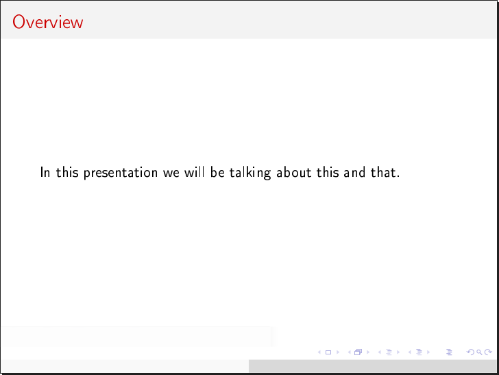
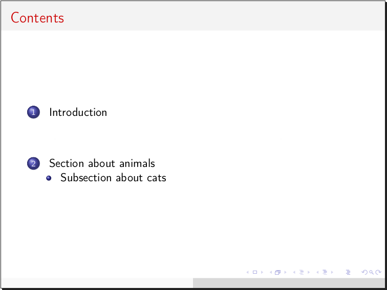
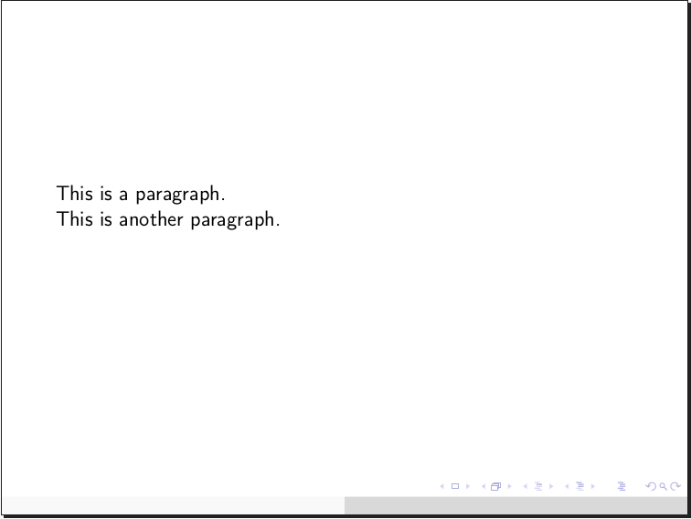
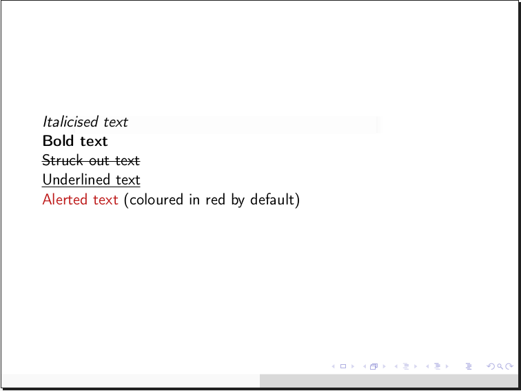
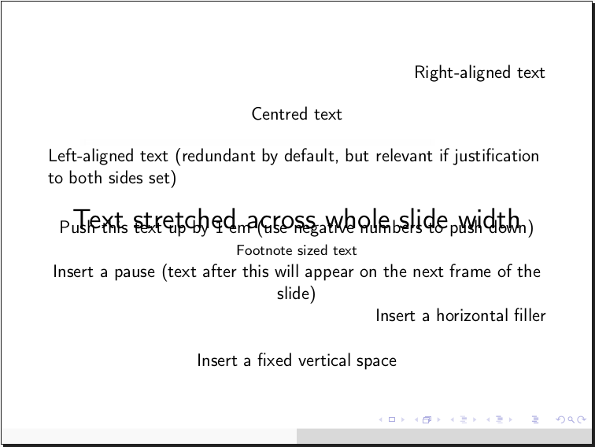
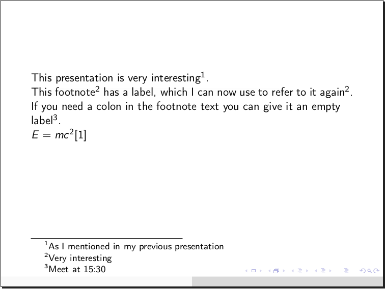
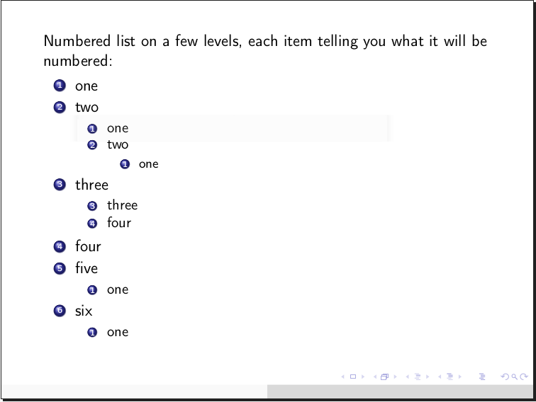
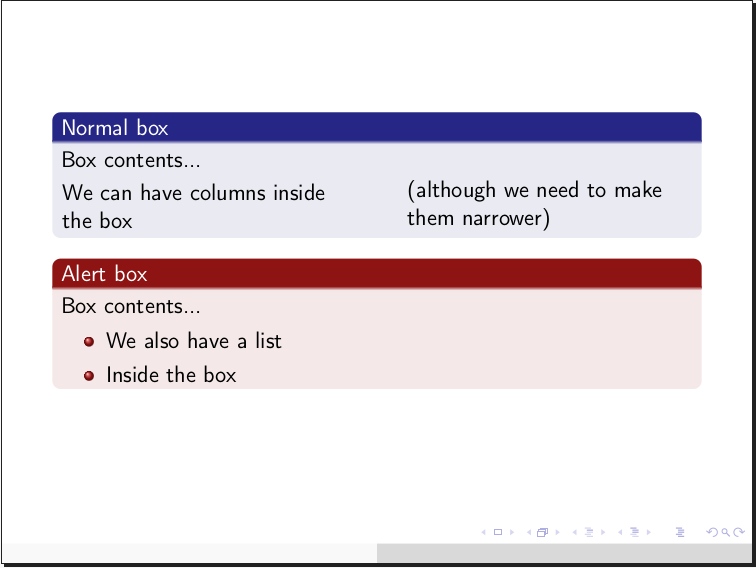
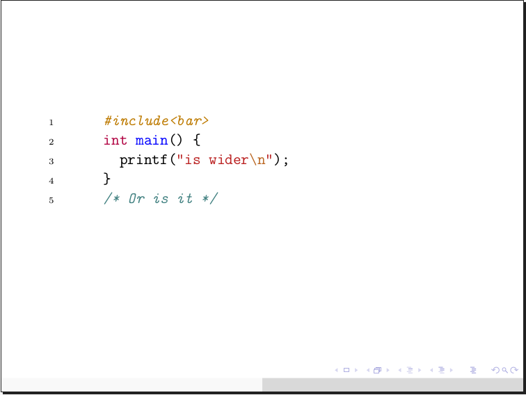

# What's this?

Beamr is a markup language (and interpreter thereof) for creating PDF slide shows from simple, easy to understand text files.

Please note: the language, its interpreter, as well as this very page, are currently under active development. This makes right now the perfect time to suggest features and discover problems.

# Installation

Simplest way, install from PyPI using Pip:

    pip install beamr

Then check that it installed properly:
    
    beamr -h

This should print the help message. The `beamr` executable might not be immediately recognised due to [a common Pip issue](https://github.com/pypa/pip/issues/3813), in which case you will need to add it to your shell's path:

    export PATH="$HOME/.local/bin:$PATH"

To avoid typing the above command every time you start a new shell instance, add it to the end of your shell configuration. On most systems using `bash`, this is accomplished by:

    echo 'export PATH="$HOME/.local/bin:$PATH"' >> ~/.bashrc

You can always run the package explicitly as well. Check that the help message is being displayed:

    python -m beamr -h

If installing system-wide (with `sudo`) you may see some warnings about file access permissions (`Errno 13`) when running `beamr` subsequently. They are inoffensive, but you can get rid of them by running the program with `sudo` once, allowing a certain module to fix itself persistently.

Alternatively, [download a copy from Github](https://github.com/teonistor/beamr/zipball/master) and run the package locally: `python -m beamr` (with the various caveats of doing so, circumventable by setting shell aliases, paths etc)

## Dependencies

The interpreter runs on Python 2.7 and 3.4 onwards. Bugs are more likely on 2.7 as backwards compatibility has been added later.

The following Python packages are mandatory and will be added automatically when installing using Pip:
- `ply` 3.11 or newer
- `pyaml` 17.12 or newer
- `docopt` 0.6 or newer

The intended use of the program requires `pdflatex` to be called internally; for this a number of `texlive` packages are required and can be installed from the system package manager, e.g.:

    apt install texlive-latex-base texlive-generic-recommended texlive-fonts-recommended texlive-font-utils texlive-extra-utils cm-super

(These are the packages I have installed on my system and it works. Perhaps not all of them are needed.)

However if you plan to simply generate LaTeX sources to use in an external engine (e.g. Sharelatex) you can do so without having `texlive` installed at all.

Optional dependencies:
- `PIL` package for certain more advanced image arrangement features – installable from Pip:
  
      pip install Pillow
  
- `pygmentize` executable for code listings using the *minted* environment – installable from your system package manager e.g.:

      apt install python-pygments


## Configuration

The program employs cascade-style configuration where many of the LaTeX constructs are defined and can therefore be altered if the user so desires. Configuration can be given in a number of places which take the following order of precedence:
1. Command-line general configuration override (e.g. `--config='scheme: albatross'`)
1. Input file Yaml blocks, top-down (examples below)
1. User configuration file (`~/.beamrrc`) Yaml blocks, top-down (examples below)
1. Implicit configuration dictionary (as defined in `beam.interpreters.config`)

Examples:

    # Set author and title for the document
    author: John Doe
    title: A Presentation on Presentations
    
    # Set the date to be used on the title page (if unset, Beamer will use the current date by default)
    date: 32nd February 2151
    
    # Tell the program to generate a title page
    titlepage: yes
    
    # Set double-asterisk emphasis to colour the text green instead (note Yaml dictionary inside dictionary syntax, as well as the single quotes around strings with special characters)
    emph:
	'**': '\color{green}{{ "{%s" }}}'
    
    # Tell LaTeX to import 2 additional packages, where the second package requires options (note Yaml list syntax)
    packages:
	- mypackage
	- option,otheroption,myotherpackage


To edit the user configuration file use the `-e` (or `--edit`) flag and supply your preferred text editor, e.g.: `beamr -e kate`. On subsequent runs the editor can be ommitted as it will be saved in the configuration (unless you purposefully remove it). You can also dump the entire default configuration at the end of this file to more easily understand how and what can be edited: `beamr -ed`

# Language specification

## Summary of constructs

The following constructs will be referred to throughout this documentation. Below is a handy table outlining which constructs can be used where by their line span:

&nbsp; | Out of slide | In slide | Either
---:| ------------- | ------------- | -----
\>0 | Ignored text | Image frame, list, macro, text |
1   | Scissors | Square bracket constructs, emphasis, escaping, inline LaTeX | Comment
\>1 | Slides | Column, box, Org table, verbatim, Plus | Raw LaTeX
2   | Heading |      |
\>2 | Yaml configuration | |


## Document structure

At the outmost level of an input file reside 4 types of elements:

1. **Slides** are delimited by opening and closing square brackets, placed at the very beginning of lines of text (with no white space). An optional slide title can be given after the opening bracket.

    Example:
```
[ Overview
 In this presentation we will be talking about this and that.
]
```

   

    Shrink (`.<number>`) or break (`...`) options can be specified immediately after the opening square bracket; these are useful when a slide has too much content to fit in under default settings.

    Examples:
```
[... Long slide
If this text is too long, it will be split across multiple slides.
]
[.20
This slide has no title, but its text will be 20% smaller than usual.
]
[.
This slide has no title, but its text will be automatically shrunk to fit if it's too large.
]
```

1. **Headings** are given outside by following a line of text with a streak of one of the symbols `- _ = ~` repeated at least 4 times. Headings should be surrounded by a visibly empty line before and after. The symbols will be understood to define sections, subsections, and subsubsections in the order in which they are encountered. 

    Example:
    ```
   Introduction
   ----

   Section about animals
   ----

   Subsection about cats
   ~~~~
    ```
    
    

1. **Configuration** can be given in the form of Yaml blocks surrounded by `---` and `...`.

    Example:
    ```
   ---
   theme: Berkeley
   scheme: beetle
   ...
    ```

1. **Document concatenation**. Pages can be added from another document by giving its name and page ranges in the *scissors* construct:
    ```
   8<{otherdoc.pdf 2-5,7,10}

   # The scissors can go both ways, e.g.:
   >8{yetanotherdoc.pdf 7-9,14}
    ```

1. Any other text which does not fall into these categories is ignored (in the future there will be options to add notes to slides and export handouts with those notes separately from the plain slide show).


## Slide structure

1. **Plain text**: Just write it. Paragraphs need to be separated by an empty line, as per LaTeX convention. Be aware of the structures below, as your text can be interpreted as one of them.

    Example:
    ```
   This is a paragraph.

   This is another paragraph.
    ```
    
    

1. **Text highlighting** is achieved by surrounding the highlighted text in one or two of the symbols `_ * ~`. 

    Example:
    ```
   _Italicised text_
   *Bold text*
   ~~Struck out text~~
   __Underlined text__
   **Alerted text** (coloured in red by default)
    ```
    
    

1. **URLs** can be made clickable by surrounding them in square brackets; they should be on a single line.

    Example:
    ```
   [https://www.example.com/]
    ```

1. **Text stretching, alignment, and other square-bracket constructs**:
    ```
   [>Right-aligned text>]

   [>Centred text<]

   [<Left-aligned text (redundant by default, but relevant if justification to both sides set)<]

   [<Text stretched across whole slide width>]

   [^1em^] Push this text up by 1 em (use negative numbers to push down)

   [.Footnote sized text.]

   [+] Insert a pause (text after this will appear on the next frame of the slide)

   [>] Insert a horizontal filler

   [:] Insert a fixed vertical space
    ```
    
    
    
    You can customize sequences of up to 3 of the symbols above to perform commands of your choice in your configuration. Always remember to use the `%s` placeholder where text will be inserted.

1. **Footnotes, citations**:
    ```
   This presentation is very interesting[-As I mentioned in my previous presentation-].

   This footnote[-24:Very interesting-] has a label, which I can now use to refer to it again[-24:-].

   If you need a colon in the footnote text you can give it an empty label[-:Meet at 15:30-].

   $E=mc^2$[--einstein]
    ```
    
    
    
    Note that for historical reasons, in order for citations to work you must create a bibliography file and specify at some point in the configuration (e.g. `bib: filename`); then you must compile the bibliography file using `bibtex` and run LaTeX (directly or implicitly through Beamr) twice for all references to settle. Similarly, re-referenced footnotes will need two runs of `pdflatex` to be fully resolved.
    
1. **Columns** are begun by a vertical bar, followed optionally by a width specifier which can be absolute (e.g. `10em`, `60pt`), relative to slide width (e.g. `35%`), or relative to other columns (e.g. `7`); in the third case, columns will split between themselves, proportionally with their numbers, the space unclaimed by columns in the second case. Columns without a width specifier will split equally between them the space unclaimed by columns in the second case, therefore they do not make sense in the same context as columns in the third case. Column contents follow on subsequent lines and must be indented relative to the column marker (vertical bar). Multiple column environments can exist on the same slide, as well as columns inside columns, although that is a rather strange use case.

    Examples:
    ```
   [
   Text before the columns

   |30%
     This is a narrow column on the left

   |
     This is a wide column on the right
 
   Text after the columns
   ]

   [
   |1
     First column

   |4
     Second column, which is 4 times as wide as the first
   ]
    ```
    
    

1. **Lists** are created using list item markers which are composed of a few characters:
    - Start with `-` for a normal item, `*` for a highlighted one
    - Add `.` or `,` for a numbered list, the difference being that if this is the first item of the current numbered list `,` will resume the counter from the pevious numbered list of the same depth. Or add `=` for a description list, where the describee will be separated from the description by a further `=`; if this is absent, the first word will be considered to be the describee. Adding none of these results in an unnumbered list.
    - Add '+' for items you wish to be revealed in turn on the next frame of the slide.
  
    List items can contain lists themselves, multiple paragraphs etc. This is accomplished by indenting the contents of the list item relative to the marker.

    Examples:
    ```
   [
   Ordinary bullet list:

   - bullet
   - bullet
   - more bullet
   ]

   [
   Numbered list on a few levels, each item telling you what it will be numbered:

   -. one
   -, two
     -, one
     -. two
       -. one
   -. three
     -, three
     -, four
   -. four
   -, five
     -. one
   -. six
     -. one
   ]

   [
   Description list:

   -=Apple=a fruit
   -=Fruit with long name=another fruit
   -=Potato vegetable
   ]

   [
   List where items will be revealed one by one and highlighted when they appear:

   *+ one
   *+ more
   *+ time
   ]
    ```
    
    

1. **Boxes** are created using round brackets and one of the symbols `*`, `!`. The box title follows this symbol on the same line. The contents follow on subsequent lines, indented relative to the opening bracket. The closing bracket must be on its own line and on the same level of indentation as the opening one.

    Examples:
    ```
   (* Normal box
      Box contents...
      |45%
        We can have columns inside the box
      |45%
        (although we need to make them narrower)
   )

    (! Alert box
      Box contents...
      - We also have a list
      - Inside the box
    )
    ```
    
    

1. **Images** can be added individually or in strips or grids. PIL support is coming soon, which will allow images to be better aligned without distorsions in a grid.

    Examples:
    ```
   One image, half-width:
   ~{file 50%}

   One image, 10 cm wide by 2 em tall:
   ~{file 10cmx2em}

   A vertical strip of 3 images (by default being as tall as the slide:
   ~{file1 file2 file3 |}

   A horizontal strip of 4 images, 15 cm wide:
   ~{file1 file2 file3 file4 - 15cm}

   A grid of 4 images:
   ~{file1 file2
     file3 file4 +}
    ```

1. **Verbatim text** for code listings in 2 flavours: listings, minted. Choose minted in the config if you have `pygmentize` installed (otherwise `pdflatex` will fail).
    ```
   {{ "{" }}{c++ 
    #include<bar>
    int main() {
      printf("is wider\n");
    }
    /* Or is it */
   }}
    ```
    
   

1. **Tables** are supported in Org Mode format:
    ```
   |------------------|
   | Dec|| Bin  ||Hex |
   |------------------|
   |  2  | 10    | 2  |
   |  18 | 10010 | 12 |
   |  31 | 11111 | 1F |
   |------------------|
    ```
    
    This construct can be used outside slides as well.

1. **Raw LaTex** can be included via the `&{...}` construct. Note that the closing brace must align vertically with the ampersand:
    ```
   &{
    \some \latex
    \commands{}
   }
    ```
    
    This construct can be used outside slides as well.

1. **Special characters and escaping**. Special characters will generally go through unaltered, unless they form part of structures described here. Any character can be escaped by adding a backslash (`\`) before it. Lone `%` and `&` characters will be escaped when going into LaTeX because they tend to cause a lot of trouble.

1. **Native LaTeX commands** can be inserted if more advanced behaviour is desired, taking care to escape characters which form part of structures described here (most notably, square brackets). Extra packages can be added to the configuration to be included at the beginning. Beware of potential clashes between custom commands and packages and those used and generated by the program.

1. Macros (coming later)

1. Integration with Plus (coming later)

## Comments

Comments can be given by using the hash symbol `#`. Should this symbol be actually required in the document, it can be escaped: `\#`. Note that comments do not work inside certain structures (most of them). Also note that `#` is problematic in LaTeX and therefore will in turn be escaped for you in the LaTeX source (this will not happen inside raw LaTeX blocks or inline commands, which are the only places where you could ever need a lone `#` in LaTeX).

# Full document examples

You can [download these examples from the repository](https://github.com/teonistor/beamr/tree/examples) when they become available.
