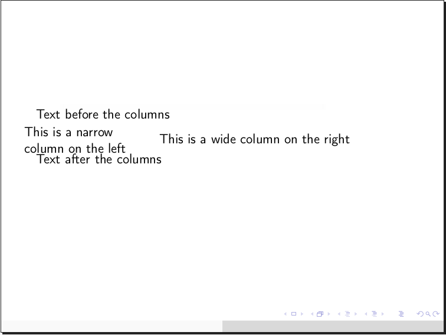

# What's this?

Beamr is a markup language (and interpreter thereof) for creating PDF slide shows from simple, easy to understand text files.

Please note: the language, its interpreter, as well as this very page, are currently under active development. This makes right now the perfect time to suggest features and discover problems.

# Installation

Simplest way, install from PyPI using Pip:

    pip install beamr

Then check that it installed properly:
    
    beamr -h

This should print the help message. The `beamr` executable might not be immediately recognised due to [a common Pip issue](https://github.com/pypa/pip/issues/3813), in which case you will need to add it to your shell's path:

    export PATH="$HOME/.local/bin:$PATH"

To avoid typing the above command every time you start a new shell instance, add it to the end of your shell configuration. On most systems using `bash`, this is accomplished by:

    echo 'export PATH="$HOME/.local/bin:$PATH"' >> ~/.bashrc

You can always run the package explicitly as well. Check that the help message is being displayed:

    python -m beamr -h

If installing system-wide (with `sudo`) you may see some warnings about file access permissions (`Errno 13`) when running `beamr` subsequently. They are inoffensive, but you can get rid of them by running the program with `sudo` once, allowing a certain module to fix itself persistently.

Alternatively, [download a copy from Github](https://github.com/teonistor/beamr/zipball/master) and run the package locally: `python -m beamr` (with the various caveats of doing so, circumventable by setting shell aliases, paths etc)

## Dependencies

The interpreter runs on Python 2.7 and 3.4 onwards. Bugs are more likely on 2.7 as backwards compatibility has been added later.

The following Python packages are mandatory and will be added automatically when installing using Pip:
- `ply` 3.11 or newer
- `pyaml` 17.12 or newer
- `docopt` 0.6 or newer

The intended use of the program requires `pdflatex` to be called internally; for this a number of `texlive` packages are required and can be installed from the system package manager, e.g.:

    apt install texlive-latex-base texlive-generic-recommended texlive-fonts-recommended texlive-font-utils texlive-extra-utils cm-super

(These are the packages I have installed on my system and it works. Perhaps not all of them are needed.)

However if you plan to simply generate LaTeX sources to use in an external engine (e.g. Sharelatex) you can do so without having `texlive` installed at all.

Optional dependencies:
- `PIL` package for certain more advanced image arrangement features – installable from Pip:
  
      pip install Pillow
  
- `pygmentize` executable for code listings using the *minted* environment – installable from your system package manager e.g.:

      apt install python-pygments


## Configuration


Examples:

    # Set author and title for the document
    author: John Doe
    title: A Presentation on Presentations
    
    # Set the date to be used on the title page (if unset, Beamer will use the current date by default)
    date: 32nd February 2151
    
    # Tell the program to generate a title page
    titlepage: yes
    
    # Set double-asterisk emphasis to colour the text green instead (note Yaml dictionary inside dictionary syntax, as well as the single quotes around strings with special characters)
    emph:
	'**': '\color{green}{{ "{%s" }}}'
    
    # Tell LaTeX to import 2 additional packages, where the second package requires options (note Yaml list syntax)
    packages:
	- mypackage
	- option,otheroption,myotherpackage


To edit the user configuration file use the `-e` (or `--edit`) flag and supply your preferred text editor, e.g.: `beamr -e kate`. On subsequent runs the editor can be ommitted as it will be saved in the configuration (unless you purposefully remove it). You can also dump the entire default configuration at the end of this file to more easily understand how and what can be edited: `beamr -ed`

# Concept

The fundamental building block of a Beamr source is the slide. A slide show is a succession of slides, in the order given in the input file; however, more pages can be generated in the resulting PDF document than there are slides in the input file (for instance because of an automatically generated table of contents, or due to transitions inside slides).

Within the slides, text can be written plainly or by employing any of the numerous constructs which are discussed in detail in the next section.

The generation of LaTeX code (and thus of the resulting PDF document) is driven by a user-editable configuration taking the form of a large dictionary, which can be altered by inserting Yaml blocks in the source file (outside slides), in a configuration file in the user's home directory, or directly via command line arguments. The order of precedence of these blocks as well as the meanings of different dictionary keys are explained further down.

# Language specification

## Summary of constructs

The following constructs will be referred to throughout this documentation. Below is a handy table outlining which constructs can be used where by their line span, which will be useful to remember:

&nbsp; | Out of slide | In slide | Either
---:| ------------- | ------------- | -----
\>0 | Ignored text | Image frame, list, macro, text |
1   | Scissors | Square bracket constructs, emphasis, footnotes, escaping, inline LaTeX | Comment
\>1 | Slides | Column, box, Org table, verbatim, Plus | Raw LaTeX
2   | Heading |      |
\>2 | Yaml configuration | |


## Slide
    [<modifier> <title>
      <content>
    ]

Opening and closing square brackets must be placed at the very beginning of lines of text (with no white space). Everything inside is optional:

`<modifier>`: Specify what should happen if the contents of the slide do not fit on a page. They can be split across multiple pages (`...`) or shrunk to fit (`.`). You can also enforce shrinking by a percentage of your choice (e.g. `.14`)

`<title>`: The title of the slide

`<content>`: The content of the slide. Indentation is optional but may help you better visualise the structure of your document.


Examples:
    [ First slide
      In this presentation we will be talking about slides.
    ]
    [ Second slide
      This is the second slide.
      
      It contains two paragraphs.
    ]
    [.20 Third slide
      The text on this slide will be 20% smaller than usual.
    ]
    [
      This slide has no title.
    ]


## Text

Plain text is simply written as such. Paragraphs need to be separated by an empty line, as per LaTeX convention.


## Heading
    <title>
    <symbol streak>
    
Headings are given outside of slides by following a line of text with a streak of one of the symbols `- _ = ~` repeated at least 4 times. Headings should be surrounded by a visibly empty line before and after. The symbols will be understood to define sections, subsections, and subsubsections in the order in which they are encountered in the source file. 

Example:

    Introduction
    ----

    Section about animals
    ----

    Subsection about cats
    ~~~~
    
    Subsection about dogs
    ~~~~
    


## List
Unnumbered list: `<marker><pause> <content>`

Restarting numbered list: `<marker>.<pause> <content>`

Resuming numbered list: `<marker>,<pause> <content>`

Description list: `<marker>=<pause> <describee>=<description>` or `<marker>=<pause> <content>`

`<marker>`: A dash (`-`) for a normal item, or an asterisk (`*`) for a highlighted one

`<pause>`: Optionally add a plus symbol (`+`) for items you wish to be revealed in turn on the next page of the slide

`<content>`: The content of the list item. This can be multiline and contain any other in-slide constructs but needs to be indented relative to the marker.

`<describee>`, `<description>`: In a description list, a multi-word describee needs to be separated from the description by an equal sign. If this is missing, the first word of the content will be considered to be the describee


Examples:
    [
    Ordinary bullet list:

    - bullet
    - bullet
    - more bullet
    ]

    [
    Numbered list on a few levels, each item telling you what it will be numbered:

    -. one
    -, two
      -, one
      -. two
	-. one
    -. three
      -, three
      -, four
    -. four
    -, five
      -. one
    -. six
      -. one
    ]

    [
    Description list:

    -=Apple=a fruit
    -=Fruit with long name=another fruit
    -=Potato vegetable
    ]

    [
    List where items will be revealed one by one and highlighted when they appear:

    *+ one
    *+ more
    *+ time
    ]
    


## Column
    |<width specifier>
      <content>
      
`<width specifier>` (optional): Can be absolute (e.g. `10em`, `60pt`), relative to slide width (e.g. `35%`), or relative to other columns (e.g. `7`). In the third case, columns will split between themselves, proportionally with their numbers, the space unclaimed by columns in the second case. Columns without a width specifier will split equally between them the space unclaimed by columns in the second case, therefore they do not make sense in the same context as columns in the third case.

`<content>`: Can contain any in-slide construct. Must be indented relative to the vertical bar

Multiple column environments can exist on the same slide, as well as columns inside columns, although that is a rather strange use case.

Examples:

    [
    Text before the columns

    |30%
      This is a narrow column on the left

    |
      This is a wide column on the right

    Text after the columns
    ]

    [
    |1
      First column

    |4
      Second column, which is 4 times as wide as the first
    ]




## Emphasis
`<flag><text><flag>`

`<flag>`: `_` for italics, `*` for bold, `__` for underline, `**` for alert (coloured in red by default). The closing flag must match the opening one.

`<text>`: The text to be emphasised. It must not start or end with white space. It cannot be broken across multiple lines, but it can contain other constructs that fit on one line.

Example:
    [
    _Italicised text_

    *Bold text*

    __Underlined text__

    **Alerted text**

    __*Bold and underlined*__

    *Bold and _italics_*
    ]


## Square Bracket Construct
Long form: `[<flag><text><flag>]`

Short form: `[<flag>]`

`<flag>`: A combination of up to 3 of the following characters: `<>_^:+*~.`. The closing flag must match the opening one, except if it is a single angle bracket.

`<text>`: The text to be processed. It cannot be broken across multiple lines, but it can contain other constructs that fit on one line.

This construct is intended for customisation. You can define your own long-form and short-form commands in the configuration, as will be detailed in the next section. There are many combinations to choose from the characters above and a few have been defined by default:
- (no flag): Clickable URL
- `<>`: Text stretched across whole slide width
- `><`: Centred block of text
- `<<`: Left-aligned block of text (redundant by default, but relevant if justification to both sides set)
- `>>`: Right-aligned block of text
- `+` : Insert a pause (text after this will appear on the next page of the slide)
- `>` : Insert a horizontal filler
- `^^`: Push this text up by amount specified, e.g. 3em (use negative numbers to push down)
- `..`: Footnote sized text
- `:`: Insert a fixed vertical space of 5mm
- `~`: Struck out text

The interpreter looks up what to do in the following order: first it checks for both the start and the end flags, concatenated; then for the start flag alone; then for the start flag in the emphasis dictionary. This last point means that you can also create bold, underlined text etc through the square bracket construct, which is helpful if you use symbols in text in a way that could be misinterpreted as flags.

Keep in mind the order above when defining your own commands. For instance, if you want to use the construct like this: `[^_ fancy text ^_]` it is OK to add your command to the key `^_` since this key is not already in use. On the other hand, if you wish to do something like `[>< fancier text ><]` you need the key in the dictionary to be `><><`, as merely using `><` would obliterate the centred text command already defined (this would not break the program, but could lead to unexpected results).

Examples:
    [
    [>Right-aligned text>]

    [>Centred text<]

    [.Footnote sized text.]

    [>]Let's[>]use[>]horizontal[>]fillers[>]~

    [^-3cm^]Push this text down by 3~cm

    For more information visit [https://teonistor.github.io/beamr/]
    ]

    [
    [<Boom!>]
    ]


## Footnotes and citations
Footnote with label: `[-<label>:<text>-]`

Footnote without label: `[-<text>-]` or `[-:<text>-]` (if the text contains a colon)

Re-reference a previous footnote: `[-<label>:-]`

Citation with options: `[--<citation>:<options>]`

Citation without options: `[--<citation>]`

`<label>`: An optional label that can be attached to a footnote to allow it to be referenced more than once

`<text>`: Footnote text. It cannot be broken across multiple lines, but it can contain other constructs that fit on one line.

`<citation>`: Name of an entry in the bibliography file (defined in the configuration as detailed in the next section)

`<options>`: Additional options to be passed to LaTeX's `\cite` command


Example:
    [
    This presentation is very interesting[-As I mentioned in my previous presentation-].

    This footnote[-24:Very interesting-] has a label, which I can now use to refer to it again[-24:-].

    If you need a colon in the footnote text you can give it an empty label[-:Meet at 15:30-].

    $E=mc^2$[--einstein]
    ]
    

    
Note that for historical reasons, in order for citations to work you must create and specify a bibliography file , then compile it using `bibtex` and run LaTeX (directly or implicitly through Beamr) twice for all references to settle. Similarly, re-referenced footnotes will need two runs of `pdflatex` to be fully resolved.


## Box
    (<flag> <title>
      <content>
    )

`<flag>`: An asterisk (`*`) for a normal box, a bang (`!`) for an alert box, or a question mark (`?`) for an example box

`<title>` (optional): The title of the box

`<content>`: Can contain any in-slide construct. Indentation relative to the round brackets is recommended but not mandatory.

The closing paranthesis must be on the same level of indentation as the opening one.

Examples:
    [
    (* Normal box
        Box contents...
        |45%
          We can have columns inside the box
        |45%
          (although we need to make them narrower)
    )

    (! Alert box
      Box contents...
      - We also have a list
      - Inside the box
    )
    ]
    


1. **Configuration** can be given in the form of Yaml blocks surrounded by `---` and `...`.

    Example:
    ```
   ---
   theme: Berkeley
   scheme: beetle
   ...
    ```

1. **Document concatenation**. Pages can be added from another document by giving its name and page ranges in the *scissors* construct:
    ```
   8<{otherdoc.pdf 2-5,7,10}

   # The scissors can go both ways, e.g.:
   >8{yetanotherdoc.pdf 7-9,14}
    ```

1. Any other text which does not fall into these categories is ignored (in the future there will be options to add notes to slides and export handouts with those notes separately from the plain slide show).


1. **Images** can be added individually or in strips or grids. PIL support is coming soon, which will allow images to be better aligned without distorsions in a grid.

    Examples:
    ```
   One image, half-width:
   ~{file 50%}

   One image, 10 cm wide by 2 em tall:
   ~{file 10cmx2em}

   A vertical strip of 3 images (by default being as tall as the slide:
   ~{file1 file2 file3 |}

   A horizontal strip of 4 images, 15 cm wide:
   ~{file1 file2 file3 file4 - 15cm}

   A grid of 4 images:
   ~{file1 file2
     file3 file4 +}
    ```

## Code listings
1. **Verbatim text** for code listings in 2 flavours: listings, minted. Choose minted in the config if you have `pygmentize` installed (otherwise `pdflatex` will fail).
    ```
   {{ "{" }}{c++ 
    #include<bar>
    int main() {
      printf("is wider\n");
    }
    /* Or is it */
   }}
    ```
   

1. **Tables** are supported in Org Mode format:
    ```
   |------------------|
   | Dec|| Bin  ||Hex |
   |------------------|
   |  2  | 10    | 2  |
   |  18 | 10010 | 12 |
   |  31 | 11111 | 1F |
   |------------------|
    ```
    
    This construct can be used outside slides as well.

1. **Raw LaTex** can be included via the `&{...}` construct. Note that the closing brace must align vertically with the ampersand:
    ```
   &{
    \some \latex
    \commands{}
   }
    ```
    
    This construct can be used outside slides as well.

1. **Special characters and escaping**. Special characters will generally go through unaltered, unless they form part of structures described here. Any character can be escaped by adding a backslash (`\`) before it. Lone `%` and `&` characters will be escaped when going into LaTeX because they tend to cause a lot of trouble.

1. **Native LaTeX commands** can be inserted if more advanced behaviour is desired, taking care to escape characters which form part of structures described here (most notably, square brackets). Extra packages can be added to the configuration to be included at the beginning. Beware of potential clashes between custom commands and packages and those used and generated by the program.

1. Macros (coming later)

1. Integration with Plus (coming later)

## Escaped characters


## Comments

Comments can be given by using the hash symbol `#`. Should this symbol be actually required in the document, it can be escaped: `\#`. Note that comments do not work inside certain structures. Also note that `#` is problematic in LaTeX and therefore will in turn be escaped for you in the LaTeX source (this will not happen inside raw LaTeX blocks or inline commands, which are the only places where you could ever need a lone `#` in LaTeX).

# Configuration keys

The program employs cascade-style configuration where many parameters and LaTeX commands are defined and can therefore be altered if the user so desires. Configuration can be given in a number of places which take the following order of precedence:
1. Command-line special flags (e.g. `-u`)
1. Command-line general configuration override (e.g. `--config='scheme: albatross'`)
1. Input file Yaml blocks, top-down (examples below)
1. User configuration file (`~/.beamrrc`) Yaml blocks, top-down (examples below)
1. Implicit configuration dictionary (as defined in `beamr.interpreters.config`)

# Full document examples

You can [download these examples from the repository](https://github.com/teonistor/beamr/tree/examples) when they become available.
